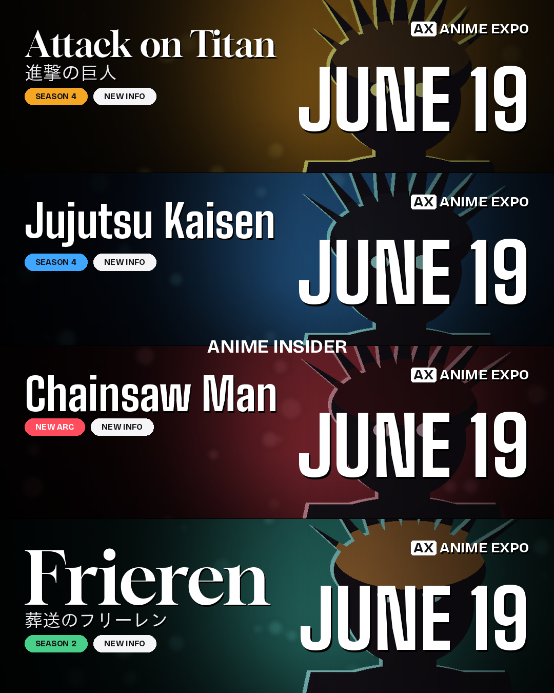
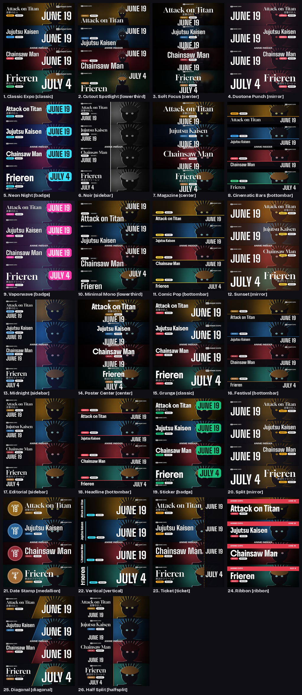
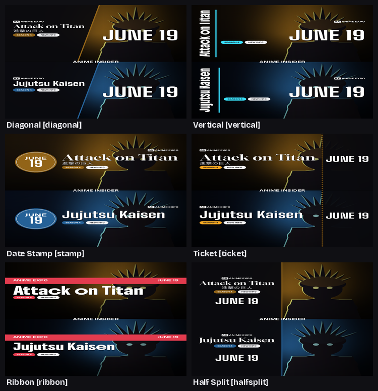
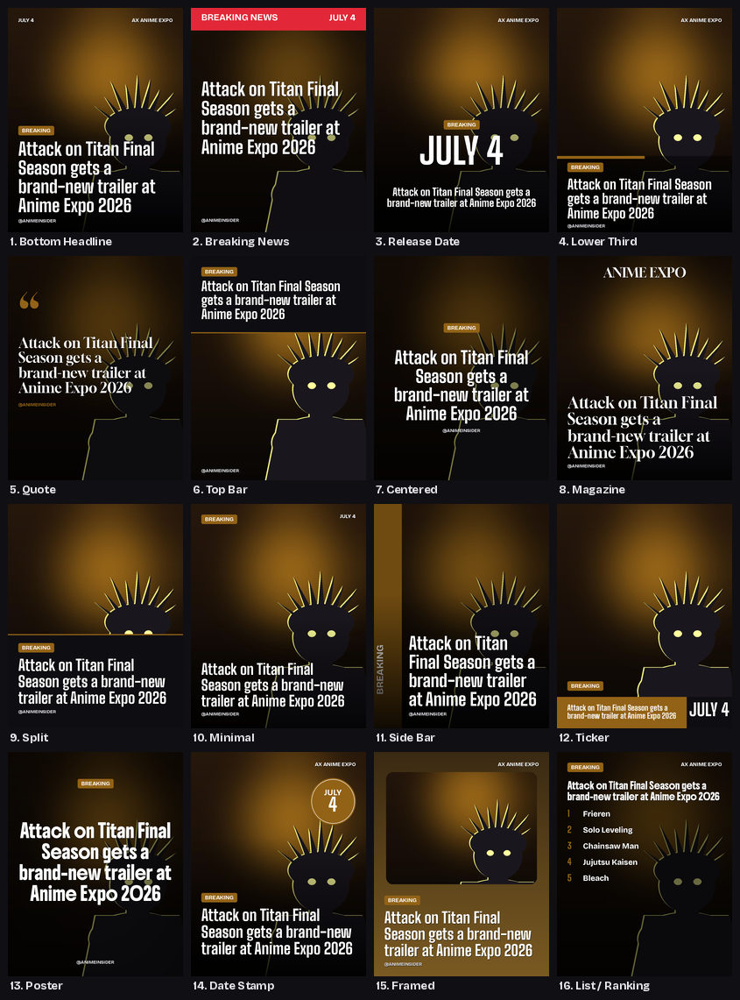
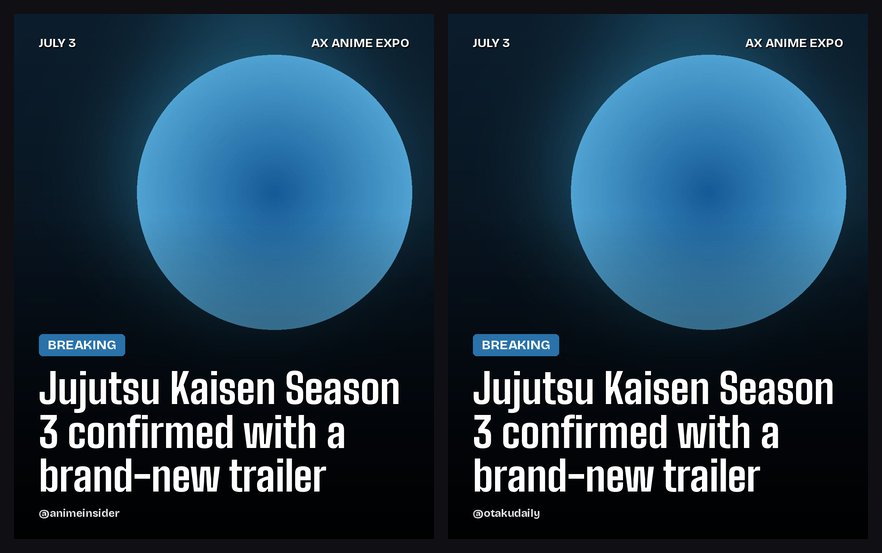

# IMAGEBOT — anime news card maker

Paste a line of news → get a **gallery of ~31 ready-to-post templates (make one, switch instantly)** to
pick from, in the “ANIME EXPO” line-up look: stacked panels with the series art,
a logo, status pills (`SEASON 4` · `NEW INFO`), the event wordmark, and a big
date — plus an auto-written caption and one-click **carousel export**.

Two modes: **line-up lists** (multi-series carousels) and **single-story news posts**
(the format the big anime-news IG/FB pages use). Run several pages? Pick up to **4 of
your handles** per generate and each render comes out stamped with that @username.

Runs **locally**. On an Ubuntu box with a GPU it also does background cut-outs,
AI upscaling, OCR watermark clean-up, and local Stable-Diffusion art.



*(Generated locally with mock key visuals. On your machine each panel uses the
real series art — AI-vision-picked, cleaned, and cut out on the GPU.)*

### Pick from a gallery of styles
One generate makes your card; then **click any of 31 templates to swap your news into it instantly** — each is a different *layout* (where the title, date, pills and art sit), no re-generating:



A few of the distinct layouts up close:



### …or single-story news posts
Switch to **News post** mode for one story per image — a wrapped headline, category
badge, source handle and date. 16 templates: Bottom Headline, Breaking News, Release
Date, Lower Third, Quote, Top Bar, Centered, Magazine, Split, Minimal, Side Bar,
Ticker, Poster, Date Stamp, Framed, and List/Ranking.



Same story, two of your accounts (handle + colour auto-matched to the art):



---

## What it does

```
your news text
   │  ▶ parse into panels (title, season, date…)     ← Claude / ChatGPT / Gemini / Grok, or built-in rules
   │  ▶ find each series' art on Google / DuckDuckGo  ← AI picks the cleanest; or upload / paste a URL
   │  ▶ (GPU, optional) cut-out · upscale · de-watermark
   │  ▶ render 1 template (switch to any of 31 instantly) ← no re-generating
   ▼
ready-to-post PNGs (1080×1350) · caption · carousel .zip (with cover slide)
```

- **31 templates — make one, swap the rest instantly** — Classic Expo, Cutout Spotlight, Soft
  Focus, Duotone, Neon Night, Noir, Magazine, Cinematic Bars, Vaporwave, Minimal
  Mono, Comic Pop, Sunset, Midnight, Poster Center, Grunge, Festival, Editorial,
  Headline, Sticker, Split, Date Stamp, Vertical, Ticket, Ribbon, Diagonal,
  Half Split, Minimal, Big Type, Breaking, Stack, Aesthetic. Each uses one of 17
  layouts (classic, centered, mirrored, side-panel, bottom-bar, lower-third,
  date-sticker, diagonal, vertical, date-medallion, ticket-stub, ribbon, half-split,
  minimal, big-type, breaking, stack). Pick one and
  download, or export the whole carousel.
- **Clean, colour-matched art** — AI vision picks the cleanest key visual; the
  accent colour (pills/badges/date) is auto-pulled from the image; the GPU stack
  can cut the character out, upscale low-res art, and inpaint existing watermarks.
- **Multi-account** — pick up to 4 of your handles per generate; each render is
  branded with that account's @username + watermark (configure in `config.yaml`).
- **Official logos** — upload a transparent PNG per series (saved to a local
  library and reused), or auto search→download→save. Overlaid instead of text.
- **Multiple AI providers** — Claude, ChatGPT, Gemini, Grok. Use one or all; with
  **no** key it still works (rule-based parser + keyless search).
- **Carousel export** — a cover slide + the line-up cards, zipped, 1080×1350.

---

## Quickstart

```bash
git clone <your-repo-url> IMAGEBOT && cd IMAGEBOT
python3 -m venv .venv && source .venv/bin/activate      # Windows: .venv\Scripts\activate
pip install -r requirements.txt
cp .env.example .env            # optional: add the keys you have
python run.py                   # opens http://127.0.0.1:8777
```

Paste news → **Make my card** → **click any template** to swap instantly → **Download** (or the carousel `.zip`).
Need it perfect? Edit any field, upload art/logo per series, then **Apply edits**.

### Local GPU box (Ubuntu + NVIDIA) — the full power

```bash
bash scripts/setup_local.sh     # venv + CUDA torch + cutout/detect/inpaint/upscale + models
```

Same proven stack as `nullemon/mangatranslator`, so it installs identically:

| Feature | Library | What it does |
|---|---|---|
| Cutout | `rembg` (isnet-anime) | character on a clean designed bg (the “Spotlight”/“Soft Focus” styles) |
| Text/watermark detect | comic-text-detector (ONNX) + CRAFT | pixel-level text-stroke masks |
| Erase | LaMa (`simple-lama-inpainting`) | surgically inpaint the detected text/watermarks |
| Upscale | Real-ESRGAN anime (via `spandrel`) | rescue low-res scraped art |
| (optional) | `manga-ocr` | read Japanese text |

All model weights are **self-contained**: `setup_local.sh` downloads them into this
bot's own `models/` folder (comic-text-detector, Real-ESRGAN anime, and the rembg
cut-out model), so nothing leaks into global caches or depends on another project.
Nothing to point at — it just works.

<details><summary>Optional — reuse a comic-text-detector you already downloaded</summary>

```bash
echo 'TEXT_SEG_MODEL=/path/to/another/comictextdetector.pt.onnx' >> .env
```
</details>

Everything auto-detects: if a lib/model/GPU isn't present the feature is skipped.
The web header shows how many GPU features are live; tick **“Clean watermarks”** in
the UI or pass `--clean` on the CLI to erase source text/watermarks from scraped art.

**Local Stable Diffusion art:** run AUTOMATIC1111/Forge/ComfyUI, set
`IMAGEBOT_SD_URL=http://127.0.0.1:7860` in `.env`, and the bot will GPU-generate
art (used as the AI-art fallback, no API cost).

---

## API keys (`.env`) — all optional

| Variable | Unlocks |
|---|---|
| `ANTHROPIC_API_KEY` | Claude — parsing, captions, **vision image-pick** |
| `OPENAI_API_KEY` | ChatGPT — parsing, captions, vision-pick, DALL·E art |
| `GEMINI_API_KEY` | Gemini — parsing, captions, vision-pick, Imagen art |
| `XAI_API_KEY` | Grok — parsing, captions, Aurora art |
| `SERPAPI_KEY` **or** `GOOGLE_API_KEY` + `GOOGLE_CSE_ID` | **reliable** Google image search (recommended) |
| `IMAGEBOT_SD_URL` | local Stable Diffusion server for GPU art |

The keyless DuckDuckGo/Bing search works but can rate-limit — add a SerpApi or
Google Programmable Search key for dependable, high-quality art. Order tried:
SerpApi → Google CSE → DuckDuckGo → Bing.

---

## Command line

```bash
# render all 31 styles + a caption
python -m imagebot make --news "Bleach S4 July 4
Frieren S3 July 4
Solo Leveling S3 July 4" --all-styles

# one style + carousel zip, AI picks images, GPU watermark clean-up, auto logos
python -m imagebot make --file news.txt --style noir --carousel --clean --find-logo

# fast preview, no search
python -m imagebot make --news "..." --no-art --style classic

# a single-story news post (16 templates; --all-templates for every one)
python -m imagebot news --news "Solo Leveling S3 confirmed, premieres July 4" --template breaking

python -m imagebot web --port 8777     # launch the UI
```

`--help` lists every flag (`--per`, `--event`, `--watermark`, `--date`,
`--ai-art`, `--no-vision`, `--cover-title`, …).

---

## How the pieces fit

```
imagebot/
  styles.py         31 curated Style presets (+ 17 distinct layouts) (the gallery you pick from)
  compositor.py     Pillow engine — backgrounds, scrims, effects, logos, dates, cover
  newscard.py       16 single-story news-post templates (wrapped headlines)
  enhance.py        OPTIONAL GPU: rembg cutout · Real-ESRGAN upscale · OCR · LaMa inpaint
  logos.py          local logo library + upload + auto search/download
  news_parser.py    news text -> structured Panels (LLM, rule-based fallback)
  image_search.py   SerpApi/CSE/DuckDuckGo/Bing + download, score, vision-pick, cache
  pipeline.py       orchestration: parse -> art/logos -> 1 template (switch to 31) -> carousel
  providers/        Claude · OpenAI · Gemini · Grok · local Stable Diffusion (lazy)
  web/              Flask app + single-page gallery UI
run.py · scripts/setup_local.sh · scripts/fetch_fonts.py
```

---

## Notes & limitations

- **You are responsible for the rights** to any image/logo you search, download,
  or repost. Treat scraped art as a mock-up; publish with licensed/official art.
- Without the GPU stack, “Cutout Spotlight” / “Soft Focus” gracefully fall back to
  a treated full-bleed background (still distinct, just not a true cut-out).
- Japanese/CJK subtitles need a CJK font — `python scripts/fetch_fonts.py` (or a
  system one). Without it, subtitles are skipped rather than shown as boxes.
- Logos are overlaid as-is; titles you don't supply a logo for render as styled
  text (sans/serif/heavy).
