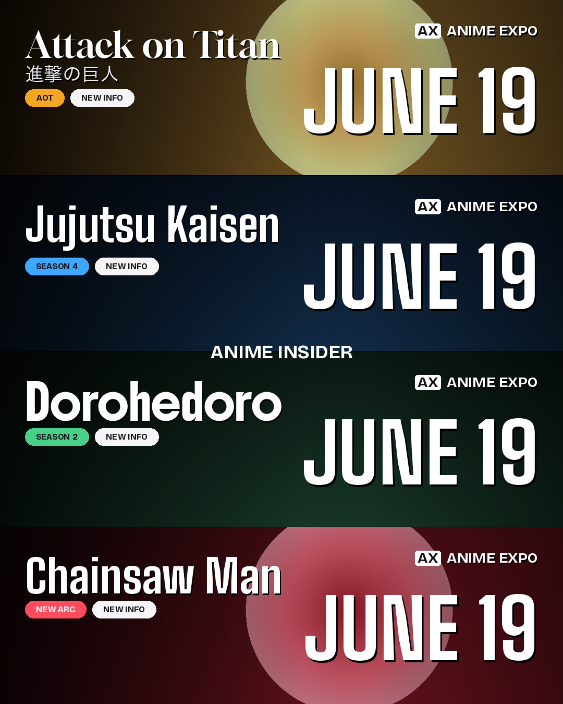

# IMAGEBOT — anime news card maker

Turn a line of news into ready-to-post announcement graphics, the same style as
those “ANIME EXPO” line-up carousels: stacked panels with the series art, a
stylized logo, status pills (`SEASON 4` · `NEW INFO`), the event wordmark, and a
big date — plus an auto-written caption.

It runs **locally on your laptop**. Paste news in a little web page, it finds
the art, builds the cards, and you download them.



*(Above: generated locally. The four backgrounds here are placeholders — with
image search on, each panel uses the real series key visual.)*

---

## What it does

```
your news text
   │  ▶ parse into panels (title, season, date…)        ← Claude / ChatGPT / Gemini / Grok, or built-in rules
   │  ▶ find each series' art on Google / DuckDuckGo     ← or upload your own
   │  ▶ composite the card (Pillow)                      ← logos, pills, wordmark, date, watermark
   ▼
ready-to-post PNG (1080×1350) + an Instagram caption
```

- **Multiple AI providers, your choice** — Claude, ChatGPT, Gemini, Grok. Set
  one key or several; pick per render. With **no** key it still works using a
  built-in rule-based parser.
- **Real art** — searches Google Images (SerpApi / Programmable Search) or
  keyless DuckDuckGo, scores candidates, caches the best. You can also paste an
  image URL or upload your own per panel.
- **Variants** — choose how many series per image (1–6), themes, logo styles
  (sans / serif / heavy), event name, watermark, and re-render instantly after
  tweaking any field.

---

## Quickstart

```bash
# 1. get the code + a virtual environment
git clone <your-repo-url> IMAGEBOT && cd IMAGEBOT
python3 -m venv .venv && source .venv/bin/activate      # Windows: .venv\Scripts\activate

# 2. install
pip install -r requirements.txt

# 3. (optional) keys — copy and edit. Skip this and it still runs.
cp .env.example .env

# 4. (optional) nicer Japanese-subtitle font
python scripts/fetch_fonts.py

# 5. run — opens http://127.0.0.1:5000 in your browser
python run.py
```

Then: paste your news → **Generate** → tweak any panel if you like → **Re-render**
→ **Download**. Finished images are saved in `output/`.

---

## API keys (`.env`) — all optional

Edit `.env` (copied from `.env.example`). Set only what you have.

| Variable | What it unlocks |
|---|---|
| `ANTHROPIC_API_KEY` | Claude — best at turning messy notes into clean panels + captions |
| `OPENAI_API_KEY` | ChatGPT (text) + DALL·E/`gpt-image-1` (AI art fallback) |
| `GEMINI_API_KEY` | Gemini (text) + Imagen (AI art fallback) |
| `XAI_API_KEY` | Grok (text) + Aurora (AI art fallback) |
| `IMAGEBOT_TEXT_PROVIDER` | `auto` (default), or pin one: `claude` / `openai` / `gemini` / `grok` / `none` |
| `SERPAPI_KEY` **or** `GOOGLE_API_KEY` + `GOOGLE_CSE_ID` | **Reliable** Google image search (recommended — see below) |

**About finding art:** the keyless DuckDuckGo backend works but is best-effort
and can rate-limit. For dependable, high-quality results add a
[SerpApi](https://serpapi.com/) key **or** a free
[Google Programmable Search](https://developers.google.com/custom-search/v1/overview)
key + engine ID. The app tries: SerpApi → Google CSE → DuckDuckGo → Bing.

---

## Using it from the command line

```bash
# one announcement per line; writes PNG(s) to output/
python -m imagebot make --news "Bleach TYBW Season 4 new info July 4
Frieren Season 3 July 4
Solo Leveling Season 3 July 4
Record of Ragnarok Season 4 July 4"

# from a file, 4 per card, a specific provider, AI-generated art fallback
python -m imagebot make --file news.txt --per 4 --provider claude --ai-art

# launch the web UI from the CLI instead of run.py
python -m imagebot web --port 8080
```

`--no-art` skips searching (themed gradients only — fast for previews).
`--help` on any command lists every flag.

---

## Customising the look

Per-render options live in the web UI / CLI flags. Defaults live in
`config.yaml` (copy from `config.example.yaml`):

- `brand.event_name` / `event_badge` — the right-side wordmark (e.g. `ANIME EXPO`, `AX`)
- `brand.watermark` — center watermark (e.g. `ANIME INSIDER`); set `""` to disable
- `brand.accent` — default pill colour
- `card.panels_per_card`, `card.width/height`
- `themes` — colour moods used for accents and for the gradient fallback when no art is found

Fonts ship in `imagebot/assets/fonts/`. Drop in your own `.ttf`s and reference
them in `imagebot/fonts.py` to change the type.

---

## How the pieces fit

```
imagebot/
  compositor.py     the Pillow engine — panels, scrims, pills, wordmark, date
  fonts.py          font resolution + CJK handling + auto-sizing
  news_parser.py    news text -> structured Panels (LLM, with a rule-based fallback)
  image_search.py   SerpApi / Google CSE / DuckDuckGo / Bing + download, score, cache
  pipeline.py       orchestration: parse -> find art -> composite -> caption
  providers/        Claude · OpenAI · Gemini · Grok (lazy-imported)
  web/              Flask app + single-page UI
  config.py         .env + config.yaml
run.py              launch the web UI
scripts/fetch_fonts.py   optional: download a CJK font for subtitles
```

---

## Notes & limitations

- **Logos are stylized text**, not the official series logos (those are
  copyrighted and hard to fetch cleanly). Pick `serif` / `heavy` / `sans` per
  panel to taste, or upload a transparent logo as the panel art.
- **You are responsible for the rights** to any image you search, download, or
  repost. Treat scraped art as a mock-up; use official/licensed art for
  publishing.
- Keyless image search can be flaky or region-blocked; add a SerpApi/CSE key for
  reliability.
- Japanese/CJK subtitles need a CJK font — run `scripts/fetch_fonts.py` (or have
  one installed system-wide). Without it, subtitles are skipped rather than
  shown as boxes.
